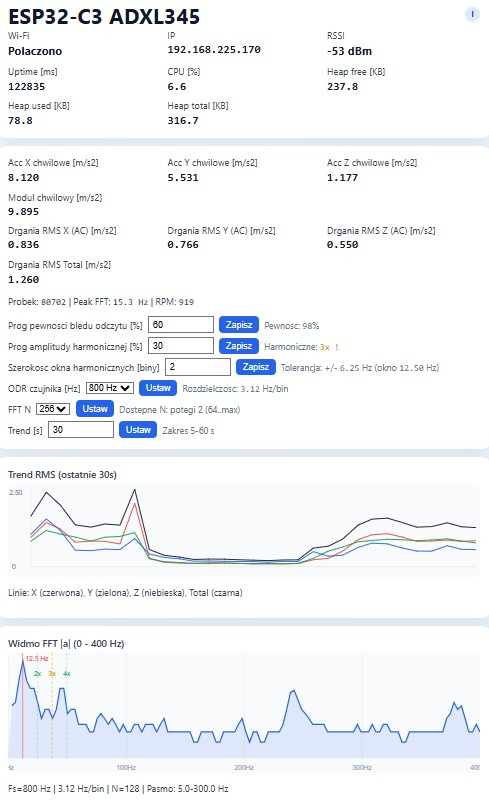

# ESP32 – Motor Vibration Monitor with FFT and RPM Estimation (ADXL345 SPI)

## Project Goal

A motor health monitoring system based on vibration analysis. The ADXL345 accelerometer (**SPI** interface) is mounted on the motor housing and provides raw X/Y/Z acceleration data. The ESP32 (WROOM) collects samples at Fs = 400 Hz, runs FFT (512-point by default, up to 4096, configurable at runtime) with an HP filter and spectrum smoothing, identifies the dominant vibration frequency and estimates **RPM**. FFT runs on X, Y, Z and a resultant (HP-filtered vector magnitude) axis — the active axis set and primary axis are configurable. Harmonic amplitudes at 2×/3×/4× of the fundamental are computed and trigger dedicated alarm flags. The firmware also calculates **peak confidence** (how clearly the FFT peak stands out from the noise floor). RPM is forced to `0` when peak confidence is below a configurable threshold. Results are exposed through both a built-in HTTP server and a lightweight **Modbus TCP** server. The HTTP side provides a status page plus `/api/status`, `/api/fft`, and `/api/config` JSON endpoints, while Modbus TCP serves measurement and configuration registers on port `502`. Optionally, a 1.3" OLED (SH1106, I²C) displays vibration data: RMS, dominant frequency, RPM and confidence, together with a Wi-Fi status icon (top-right), an isometric XYZ axis diagram (bottom-right), and the **GMINSTAL.PL** brand label (top-left). A dedicated error screen is shown when the ADXL345 is not detected.

### Recent Runtime/UI Enhancements

- Heap telemetry in `/api/status`: `heap_free_bytes`, `heap_used_bytes`, `heap_total_bytes`.
- RMS trend chart in web UI (X/Y/Z/Total), with configurable time window.
- Runtime trend window control via `/api/config?trend_window_sec=<5..60>`.
- Runtime FFT length selection via `/api/config?fft_n=<power_of_two>` with options returned by the API.
- Dynamic FFT metadata in `/api/fft` (`n`, `fft_n`, `trend_window_sec`, runtime `resolution`).

### OLED Enhancements (branch `oled`, merged to `main` 2026-04-30)

- **GMINSTAL.PL** label in top-left corner.
- **Wi-Fi status icon** (4-bar signal bars, top-right): filled = connected, no bars = disconnected.
- **XYZ axis diagram** (isometric arrows, bottom-right) mirroring ADXL345 silkscreen orientation.
- Measurement screen shows: `RMS [m/s²]`, dominant `Hz`, `RPM`, FFT confidence% (or harmonic alarm).
- **ADXL345 error screen**: when sensor is not detected at boot, a full-screen `BLAD ADXL345 / Sprawdz SPI` message replaces measurement data.

### Dashboard Screenshot



---

## Hardware

| Component | Model / parameters |
|---|---|
| Microcontroller | ESP32 WROOM (esp32dev) |
| Vibration sensor | ADXL345 (±16 g, 13-bit, **SPI**) |
| Display | 1.3" OLED SH1106, 128×64 px, I²C (optional) |
| Communication | Wi-Fi 802.11 b/g/n + HTTP WebServer |
| Power supply | 3.3 V |

### ADXL345 ↔ ESP32 wiring (SPI)

| ADXL345 | ESP32 GPIO |
|---|---|
| VCC | 3V3 |
| GND | GND |
| CS | GPIO5 |
| SCK | GPIO18 |
| SDA (MOSI) | GPIO23 |
| SDO (MISO) | GPIO19 |

> The Adafruit ADXL345 library requires **SPI_MODE3** (not MODE1 as in upstream). This project ships a locally patched copy in `lib/Adafruit_ADXL345/`.

### 1.3" SH1106 OLED ↔ ESP32 wiring (I²C)

| OLED | ESP32 GPIO |
|---|---|
| VCC | 3V3 |
| GND | GND |
| SDA | GPIO21 |
| SCL | GPIO22 |

I²C address: **0x3C** (configurable via `CONFIG_OLED_ADDR`).

---

## Software Architecture

```
┌─────────────────────────────────────────────────────┐
│                    ESP32 (loop)                      │
│                                                      │
│  [Acquisition – micros()-based, Fs = 400 Hz]         │
│   - ADXL345 SPI → X/Y/Z raw                         │
│   - HP IIR filter (fc ≈ 2 Hz, removes DC/tilt)      │
│   - ring buffer up to 4096 samples (default N=512)  │
│         │                                            │
│  [computeFFT() – every N samples]                    │
│   - Hamming window                                   │
│   - arduinoFFT 2.x (N-point, configurable)          │
│   - per-axis: X, Y, Z, Resultant (selectable mask)  │
│   - spectrum smoothing (EMA between frames)          │
│   - peak search in configurable Hz band             │
│   - peak confidence vs noise floor (0-100%)         │
│   - harmonics at 2×/3×/4× of fundamental           │
│   - RPM = peak_hz × 60 / order (or 0 if confidence  │
│     is below threshold)                              │
│         │                                            │
│  [HTTP WebServer]                                    │
│   GET /           → status page + FFT chart          │
│   GET /api/status → JSON: X/Y/Z, IP, RPM, confidence │
│   GET /api/fft    → JSON: mag[], peak_hz, conf, rpm  │
│   GET /api/config → read/write confidence threshold  │
│  [Modbus TCP server]                                 │
│   FC04 → input registers: X/Y/Z, RMS, alarms, FFT   │
│   FC03/FC06 → holding registers: runtime thresholds  │
│         │                                            │
│  [OLED – every 120 ms, non-blocking]                │
│   - GMINSTAL.PL label + Wi-Fi icon + XYZ axes        │
│   - RMS, peak Hz, RPM, confidence (or error screen)  │
└─────────────────────────────────────────────────────┘
```

---

## HTTP API

### `GET /api/status`

```json
{
  "wifi_connected": true,
  "ip": "192.168.1.x",
  "uptime_ms": 12345,
  "heap_free_bytes": 243456,
  "heap_used_bytes": 80720,
  "heap_total_bytes": 324176,
  "rssi": -62,
  "cpu_load_pct": 6.6,
  "manual_ref_rpm": 0.0,
  "x": 12.3,
  "y": -4.5,
  "z": 1002.1,
  "vibration": 1002.2,
  "rms_x": 0.836,
  "rms_y": 0.766,
  "rms_z": 0.550,
  "rms_total": 1.260,
  "samples": 4096,
  "peak_hz": 49.8,
  "peak_hz_filt": 49.6,
  "peak_amp": 312.5,
  "peak_confidence_pct": 78.4,
  "peak_confidence_threshold_pct": 60,
  "rpm": 2988
}
```

### `GET /api/fft`

```json
{
  "mag": [0.0, 0.1, "..."],
  "peak_hz": 49.8,
  "peak_hz_filt": 49.6,
  "peak_amp": 312.5,
  "peak_confidence_pct": 78.4,
  "rpm": 2988,
  "band_min_hz": 5,
  "band_max_hz": 300,
  "resolution": 3.125,
  "fs": 800,
  "n": 256,
  "fft_n": 256,
  "trend_window_sec": 30
}
```

### `GET /api/config`

Get current runtime config (currently confidence threshold):

```json
{
  "peak_confidence_threshold_pct": 60,
  "manual_ref_rpm": 0.0,
  "harm_ratio_thresh_pct": 30,
  "harm_max_order": 4,
  "harm_window_bins": 2,
  "harm_tolerance_hz": 0.781,
  "odr_hz": 400,
  "trend_window_sec": 30,
  "fft_n": 512,
  "fft_n_max": 4096,
  "fft_analytics_mask": 4,
  "fft_primary_axis": 2,
  "fft_n_options": [64, 128, 256, 512, 1024, 2048, 4096]
}
```

Set threshold from web/UI or client:

`/api/config?peak_confidence_threshold_pct=70`

Set trend window (seconds):

`/api/config?trend_window_sec=45`

Set active FFT length:

`/api/config?fft_n=128`

Compatibility alias is still accepted:

`/api/config?read_error_threshold_pct=70`

---

## Modbus TCP

The firmware includes a lightweight Modbus TCP server on port `502`.

Supported function codes:

- `FC 04` – Read Input Registers
- `FC 03` – Read Holding Registers
- `FC 06` – Write Single Holding Register

Default unit ID: `1`

The current implementation is single-client and intended for SCADA/HMI polling, PLC integration, and diagnostics.

---

## Project Configuration (`platformio.ini`)

```ini
[env:esp32dev]
platform  = espressif32
board     = esp32dev
framework = arduino

lib_deps =
    adafruit/Adafruit Unified Sensor
    adafruit/Adafruit BusIO
    olikraus/U8g2
    kosme/arduinoFFT          ; 2.x

build_flags =
    -D ENABLE_OLED=1
    -D ENABLE_ADXL=1
  -D ENABLE_MODBUS=1
    ; I2C / OLED
    -D CONFIG_SDA_PIN=21
    -D CONFIG_SCL_PIN=22
    -D CONFIG_OLED_ADDR=0x3C
    ; ADXL345 SPI
    -D CONFIG_ADXL_SPI_CS_PIN=5
    -D CONFIG_ADXL_SPI_SCK_PIN=18
    -D CONFIG_ADXL_SPI_MOSI_PIN=23
    -D CONFIG_ADXL_SPI_MISO_PIN=19
    -D CONFIG_ADXL_ODR=400
    ; FFT
    -D CONFIG_FFT_SIZE=4096
    -D CONFIG_FFT_N_DEFAULT=512
    -D CONFIG_FFT_FS=400
    ; Modbus TCP
    -D CONFIG_MODBUS_PORT=502
    -D CONFIG_MODBUS_UNIT_ID=1
    ; Timers
    -D CONFIG_WIFI_TIMEOUT_MS=15000
```

Wi-Fi credentials go in `include/secrets.h` (excluded from version control).
Template: `include/secrets.h.example`.

---

## ADXL345 Sensor Parameters

| Parameter | Value / range |
|---|---|
| Measurement range | ±16 g (set in firmware) |
| Resolution | 13 bit (full-resolution ON) |
| Output Data Rate (ODR) | 400 Hz (`CONFIG_ADXL_ODR`, runtime-changeable) |
| Interface | SPI @ 5 MHz, SPI_MODE3 |
| Supply voltage | 3.3 V |

---

## Mechanical Sensor Mounting

- Bolt or rigidly glue the sensor to the motor housing (near the bearings).
- Z-axis perpendicular to the shaft rotation axis – best unbalance detection.
- Avoid mounting on flexible elements (rubber, foam) – they attenuate the signal.
- SPI: shielded cable ≤ 30 cm, CS line with a 33–100 Ω series resistor.

---

## Implementation Status

| Feature | Status |
|---|---|
| ADXL345 SPI (MODE3, local lib) | ✅ working |
| OLED SH1106 I²C (U8g2) | ✅ working |
| OLED: WiFi icon + XYZ axes + branding | ✅ working |
| OLED: ADXL error screen | ✅ working |
| 800 Hz sampling (micros-based) | ✅ working |
| FFT 256-pt, Hamming window | ✅ working |
| HP IIR filter (dc/tilt rejection) | ✅ working |
| Spectrum smoothing (EMA) | ✅ working |
| Parabolic peak interpolation | ✅ working |
| FFT peak confidence (prominence vs background) | ✅ working |
| Runtime confidence threshold via `/api/config` | ✅ working |
| RPM forced to 0 below confidence threshold | ✅ working |
| RPM estimation | ✅ working |
| Web UI with canvas chart (log scale) | ✅ working |
| `/api/status` + `/api/fft` | ✅ working |
| Modbus TCP (`FC03`, `FC04`, `FC06`) | ✅ working |
| Harmonic analysis (2×/3×/4×, alarm flags) | ✅ working |
| Multi-axis FFT + resultant (HP vector mag) | ✅ working |
| Runtime ODR / FFT-N / axis mask via `/api/config` | ✅ working |

---

## References

- ADXL345 Datasheet – Analog Devices: https://cdn-shop.adafruit.com/datasheets/ADXL345.pdf
- S. R. Pandit et al., *Vibration-Based Motor Health Monitoring System Using ESP32 and ADXL345*, IJPREMS Vol. 05 Issue 04, April 2025, pp. 3550-3552
- Espressif Systems, *ESP32 Technical Reference Manual*
- kosme/arduinoFFT: https://github.com/kosme/arduinoFFT
- ISO 10816 – Mechanical vibration – Evaluation of machine vibration

---

## TODO

### Modbus TCP
- [x] Add Modbus TCP server on port 502
- [x] Input Registers (FC 04): X/Y/Z [mg], RMS, peak_hz, RPM, status
- [x] Holding Registers (FC 03/06): configurable alarm thresholds (runtime write)
- [ ] Alarm bits: RMS threshold exceeded, peak outside nominal range, sensor lost
- [ ] Test integration with SCADA/HMI (e.g. Node-RED, Ignition, Codesys)

### Vibration Analysis
- [ ] Spike detection: `|a_i| > μ + N·σ` in a rolling window
- [ ] RMS trend alarm (rolling average vs baseline, configurable threshold)
- [x] FFT on resultant HP-filtered vector magnitude (`FFT_AXIS_RESULTANT`)
- [x] Monitor harmonics at 2×/3×/4× of the rotational frequency (amplitude + alarm flags)
- [ ] Detect bearing fault characteristic frequencies (BPFI, BPFO, BSF)

### Web UI
- [ ] Historical RMS chart (last N readings, canvas or Chart.js)
- [ ] Persist confidence threshold in NVS (currently runtime only)
- [ ] Push notifications / WebSocket instead of polling `/api/fft`

### Infrastructure
- [ ] Configuration persistence in NVS/Preferences (thresholds, RPM order, FFT band)
- [ ] OTA update (ElegantOTA or ArduinoOTA)
- [ ] Logging to SD card or MQTT broker

---

## Expansion Plan

### Implementation Phases

- [x] **Phase 1** – Modbus TCP server, basic raw X/Y/Z + RMS registers
- [ ] **Phase 2** – spike detection, trend alarm, alarm bits 1–2
- [x] **Phase 3** – OLED: RMS/Hz/RPM screen, Wi-Fi icon, XYZ axes diagram, branding, error screen
- [x] **Phase 4** – FFT resultant axis, harmonic detection (2×/3×/4×), runtime axis/ODR/FFT-N config
- [ ] **Phase 5** – bearing frequencies (BPFI/BPFO/BSF), persistence in NVS/Flash

---

### Modbus TCP – Register Map

**Input Registers (FC 04)**, base address = 0:

| Address | Name | Format | Description |
|---|---|---|---|
| 0 | ACC_X_RAW | INT16 | Raw X-axis reading [LSB] |
| 1 | ACC_Y_RAW | INT16 | Raw Y-axis reading [LSB] |
| 2 | ACC_Z_RAW | INT16 | Raw Z-axis reading [LSB] |
| 3 | ACC_X_MG | INT16 | X-axis acceleration [mg] |
| 4 | ACC_Y_MG | INT16 | Y-axis acceleration [mg] |
| 5 | ACC_Z_MG | INT16 | Z-axis acceleration [mg] |
| 6 | RMS_X | UINT16 | X-axis RMS × 10 [mg] |
| 7 | RMS_Y | UINT16 | Y-axis RMS × 10 [mg] |
| 8 | RMS_Z | UINT16 | Z-axis RMS × 10 [mg] |
| 9 | RMS_TOTAL | UINT16 | √(RMS_X²+RMS_Y²+RMS_Z²) × 10 |
| 10 | ALARM_FLAGS | UINT16 | Alarm bits (see below) |
| 11 | TEMP_DEG10 | INT16 | Temperature × 10 [°C] (ADXL345 internal) |
| 12 | FFT_PEAK_HZ | UINT16 | Dominant frequency [Hz] |
| 13 | FFT_PEAK_AMP | UINT16 | Dominant component amplitude × 10 |
| 14 | SAMPLE_RATE | UINT16 | Current sampling frequency [Hz] |
| 15 | STATUS | UINT16 | Device status (0=OK, 1=FAULT) |

#### ALARM_FLAGS bit map (register 10)

| Bit | Meaning |
|---|---|
| 0 | RMS threshold exceeded (static) |
| 1 | Impact impulse detected (spike > N×σ) — *planned* |
| 2 | Vibration trend increase > threshold — *planned* |
| 3 | Dominant frequency outside nominal band |
| 4 | ADXL345 communication lost |
| 5 | Harmonic alarm: 2× fundamental |
| 6 | Harmonic alarm: 3× fundamental |
| 7 | Harmonic alarm: 4× fundamental |
| 8 | Multiple harmonics active (≥2) |
| 9–15 | Reserved |

**Holding Registers (FC 03 / FC 06)**, base address = 100 – runtime alarm threshold configuration:

| Address | Name | Description |
|---|---|---|
| 100 | THRESH_RMS | RMS threshold [mg × 10] |
| 101 | THRESH_SPIKE_N | N multiplier for spike detection |
| 102 | THRESH_TREND_PCT | Trend increase threshold [%] |
| 103 | FFT_BAND_MIN_HZ | FFT band lower limit [Hz] |
| 104 | FFT_BAND_MAX_HZ | FFT band upper limit [Hz] |
| 105 | RPM_ORDER | Harmonic order for RPM estimation |

---

### Anomaly Detection

#### 1. Static RMS Threshold
Alarm when: `RMS_TOTAL > threshold`

Vibration magnitude formula (Euclidean norm):

$$V = \sqrt{x^2 + y^2 + z^2}$$

Unit: m/s². Default startup threshold: **11.0 m/s²** (experimentally determined in IJPREMS 2025).
Configurable via Modbus HR 100.

#### 2. Spike Detection
A sample is classified as an impulse when: `|a_i| > μ + N·σ`
where μ and σ are computed over a rolling window (e.g. 1024 samples).
Parameter N (default 5) is configurable via Modbus HR 101.

#### 3. Trend Analysis
60-second rolling RMS average compared against a baseline measured at startup.
Alarm when the increase exceeds the value in HR 102 (default 20%).

#### 4. FFT Analysis – Expansion
FFT on a configurable N-sample window (default 512, max 4096). Implemented:
- resultant axis: HP-filtered vector magnitude `√(X²+Y²+Z²)`
- harmonics at 2×/3×/4× of the rotational frequency (alarm flags bits 5–8)

Planned:
- bearing fault characteristic frequencies (BPFI, BPFO, BSF)
- energy computation in diagnostic frequency bands

##### Stage A – Stable sampling (prerequisite)

- Ensure constant sampling rate (`Fs`) independent of OLED refresh and HTTP handling.
- Replace blocking delays in the main loop with micros()-based timing.
- Collect samples into a ring-buffer with timestamps to allow jitter monitoring.

**Completion criterion:** stable `Fs` (e.g. 800 Hz) and complete sample windows without data loss. ✅ *done (micros-based sampling)*

##### Stage B – Minimal FFT (1 axis, 1 metric)

- Start with FFT on a single axis (recommended: Z-axis).
- Analysis window: `N=256` (or `N=512` after performance testing).
- Apply Hamming window before computing the spectrum.
- Determine `FFT_PEAK_HZ` and `FFT_PEAK_AMP` from the maximum in the working band.
- Parabolic interpolation for sub-bin accuracy.

**Completion criterion:** correct and repeatable peak frequency detection for a test signal. ✅ *done*

##### Stage C – Modbus and alarm integration

- Publish FFT results in Modbus registers (addresses 12 and 13).
- Add alarm logic for dominant frequency outside the nominal range.
- Link FFT alarm to `ALARM_FLAGS` (bit 3).

**Completion criterion:** stable FFT readout from SCADA/HMI and correct alarm flag setting. ❌ *to do*

##### Stage D – Extended analysis

- Extend analysis to three axes and/or vector magnitude.
- Add monitoring of harmonics at 1×/2×/3× of the rotational frequency.
- Consider energy computation in diagnostic bands (bearings, unbalance).

**Completion criterion:** detection of trends and spectral characteristic changes over a longer time horizon. ❌ *to do*

---

### Licensing Notes

The `arduinoFFT` library is released under the **GPL-3.0** license.
For closed-source or commercial deployments, confirm licence compatibility or consider an alternative with a more permissive licence (e.g. a custom Cooley-Tukey implementation).